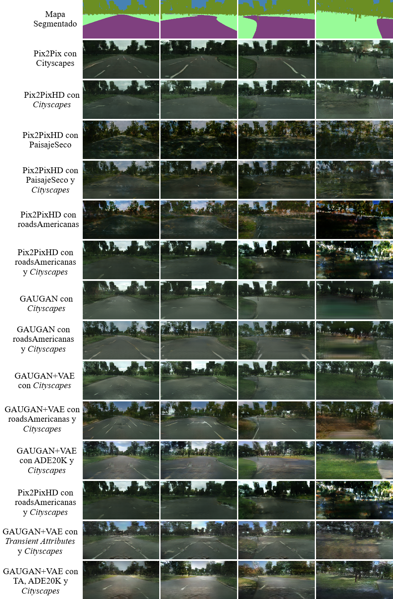
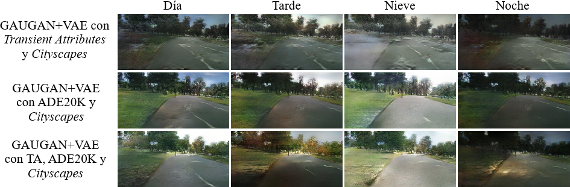

# Conducción autónoma en circuitos creados con mapas de Kohonen

**Link de la memoria del trabajo:** https://e-archivo.uc3m.es/ (Actualizado cuando esté disponible)

## Resumen del trabajo 

Este trabajo está separado en dos partes bien diferenciadas que se muestran en un mismo repositorio ya que ambas utilizan como base el mismo simulador de conducción. En concreto, las dos partes son las siguientes:

* **Conducción autónoma.** Este módulo consiste en conducir un vehículo en Unity utilizando sola y exclusivamente como entrada una imagen generada por un modelo de Red Generativa Adversaria del repositorio https://github.com/davidggz/RealisticRoadsGAN. Para ello, se toma la imagen generada por la GAN y se segmentan las líneas de la carretera y se infiere el ángulo de giro con el uso de Deep Learning.

* **Circuitos aleatorios con mapas de Kohonen.** Este módulo se encarga de generar los circuitos cíclicos del simulador mediante el uso de mapas de Kohonen, un tipo de red de neuronas no supervisada. Esta implementación en C# está basado en la implementación de Diego Vicente https://github.com/DiegoVicen/som-tsp.

Para poder llevar a cabo este proyecto, ha sido necesario utilizar como base el simulador que el usuario de GitHub **tawnkramer** ofrece en su repositorio (https://github.com/tawnkramer/sdsandbox). Todas las modificaciones se han hecho sobre ese código.

# Circuitos aleatorios con mapas de Kohonen 

## Explicación teórica
Los **mapas de Kohonen** son un tipo de red de neuronas capaz de adaptarse a un conjunto de datos de entrada. Normalmente, la red de neuronas de este tipo de arquitecturas es un conjunto de puntos en el espacio de entrada n-dimensional que se va acercando poco a poco a los patrones de entrada más próximos. Para poder hacer este proceso, es necesario tener en cuenta **dos parámetros realmente importantes**:

* **Función de vecindario.** Este parámetro indica cuáles son las neuronas que serán arrastradas junto a la neurona ganadora en cada iteración del entrenamiento. Normalmente, esta función es discreta y muy simple.

* **Forma del mapa de neuronas.** El mapa de neuronas está compuesto por el conjunto de las neuronas en sí y las conexiones que hay entre ellas. Habitualmente, el mapa de neuronas es bidimensional y cada neurona se conecta con cuatro neuronas, generando una especie de paralelogramo conceptual.

El enfoque que se aplica en este trabajo es utilizar el mapa de Kohonen para resolver el **problema del TSP** (Travelling Salesman Problem) de manera aproximada. Para hacer esto, en primer lugar el vecindario pasa de ser bidimensional a ser unidimensional circular, generando un **anillo elástico** que cambia en cada iteración. En segundo lugar, la función de vecindario pasa a ser **gaussiana**, haciendo que cada vez que una neurona es ganadora, se muevan las que están a su lado de manera ponderada.

Como se puede ver en la imagen anterior, en los resultados intermedios se obtienen resultados parecidos a lo que sería un circuito. Retocando algunos de los parámetros (en concreto, la disminución de la ganancia y del radio de la gaussiana), se puede hacer que la red **converja en un estado intermedio**, permitiendo obtener los circuitos que se están buscando. En la siguiente imagen se pueden ver tres circuitos distintos generados con el script de Python.

Una vez se consiguieron los anteriores resultados, se optó por implementar el código en C#. Se tuvieron que hacer algunos cambios sustanciales en el entrenamiento de la red de neuronas pero finalmente se consiguieron los resultados que se pueden ver en la siguiente imagen.

## Código y tutorial de uso de los circuitos

Una vez se ha descargado el proyecto de Unity y se ha importado la carpeta sdsim, el código se puede encontrar en el fichero Assets/Scripts/Kohonen.cs.

Para poder visualizar los circuitos generados con esta técnica, es necesario buscar el **GameObject** llamado **PathManager**. Una vez encontrado este objeto, se debe activar la opción **DoKohonenPath** y desactivar **DoMakeRandomPath**. Cuando esta opción ha sido cambiada, solo se debe reejecutar el simulador.

# Conducción Autónoma con imágenes sintetizadas con Redes Generativas Adversarias

Este módulo consiste hacer la conducción autónoma utilizando solo las imágenes generadas por algunos modelos de GAN obtenidos en el siguiente repositorio https://github.com/davidggz/RealisticRoadsGAN. En concreto, los dos modelos que se han utilizado son GAUGAN entrenado con Cityscapes y Pix2PixHD entrenado con Cityscapes, dos de los mejores modelos obtenidos.

El enfoque que se toma en este módulo está basado en dos fases distintas, la **segmentación de las líneas de la carretera** y la **inferencia del ángulo de giro**.

## Segmentación de las líneas de la carretera

A las imágenes generadas por las GAN se les introduce de manera artificial las líneas de la carretera para intentar emular lo que sería una carretera realista. Para segmentar estas líneas de la carretera se utiliza un **autoencoder**; una estructura convolucional con forma de reloj de arena que es entrenada de manera supervisada.

Una vez el modelo ha sido entrenado al completo, la red convolucional es capaz de segmentar las líneas de la carretera de manera correcta. Además, como las imágenes que solo tienen las líneas se han generado a partir del cuello de botella, en este se encuentran todas las características clave de las líneas de la carretera. Por este motivo, no solo se ha creado un segmentador de líneas de carretera, sino también un condensador de la información. En el siguiente gif se puede ver un ejemplo de esta segmentación:

## Modelos de síntesis de carreteras realistas 

Los modelos que se muestran en la siguiente tabla han sido entrenados con distintos conjuntos de imágenes que se explican en la memoria del trabajo de fin de grado. Algunos de ellos son ampliamente conocidos, como *Cityscapes* o ADE20K, pero igualmente se van a puntualizar algunos datos.

- ***Cityscapes***: <a href="https://www.cityscapes-dataset.com/">Cityscapes</a> es un conjunto de imágenes que contiene tanto la propia imagen realista como su par segmentado. Todas las imágenes son de carreteras alemanas desde el frontal del coche.
- **PaisajeSeco**: Este conjunto de imágenes ha sido obtenido a mano mediante la obtención de *frames* de distintas secciones del siguiente <a href="https://youtu.be/ZOZOqbK86t0">vídeo</a>.
- **roadsAmericanas**: Este conjunto de imágenes ha sido generado mediante la obtención de un *frame* cada 30 frames del mismo <a href="https://youtu.be/ZOZOqbK86t0">vídeo</a> mencionado en el conjunto de PaisajeSeco.
- **ADE20K**: Este conjunto de datos tiene muchísimas imágenes. Para acotarlo y solo utilizar imágenes relacionadas con paisajes, se utiliza un subconjunto utilizado por un trabajo llamado <a href="https://hucvl.github.io/attribute_hallucination/">Attribute Hallucination</a>.
- ***Transient Attributes***: Este conjunto de datos es un conjunto de imágenes de distintas *webcam* repartidas en distintos lugares del mundo a lo largo de las estaciones. Gracias a esto, se puede obtener un mismo mapa segmentado pero con distintos estilos. El trabajo del que se ha obtenido este conjunto de imágenes se llama <a href="http://transattr.cs.brown.edu/files/TransientAttributes-paper.pdf">Transient Attributes</a>.

### Modelos unimodales

| Modelos creados en la experimentación | Descarga |
| --- | --- |
| **Arquitectura**: Pix2Pix   ***Data sets***: *Cityscapes* (3.475 imágenes) | <a href="https://mega.nz/file/CdVRVYoC#HxjnL8TPJhWlhAGoL1qOtfXTs9wU8fdZi9yB_YJVePk"> Download </a> |
| **Arquitectura**: Pix2PixHD   ***Data sets***: *Cityscapes* (3.475 imágenes) | <a href="https://mega.nz/file/uEEFlKxa#aWWAnu70ll_FXRg_CsifXEVolP2cMlek1AylzFpV7VY"> Download </a> |
| **Arquitectura**: Pix2PixHD   ***Data sets***: PaisajeSeco (1.728 imágenes) | <a href="https://mega.nz/file/GQdTkSqZ#j91njGjlfLxUs11Qb_VcLrYNTO0dNNAq0YLtfuZpvLw"> Download </a> |
| **Arquitectura**: Pix2PixHD   ***Data sets***: *Cityscapes* (3.475)   &nbsp; &nbsp; &nbsp;&nbsp;&nbsp;&nbsp;&nbsp;&nbsp;&nbsp;&nbsp;&nbsp;&nbsp;&nbsp;&nbsp; PaisajeSeco (1.728 imágenes) | <a href="https://mega.nz/file/OREVnIQT#wlYCiex554__BI19NkA2gGuondX239kFwi7DM4sV8GA"> Download </a> |
| **Arquitectura**: Pix2PixHD   ***Data sets***: roadsAmericanas (1.992 imágenes) | <a href="https://mega.nz/file/XQ1V2JxQ#2ue1hnlZtuskKLaYsv_2b_3a9ENNwNQwKFgiHiM-ldk"> Download </a> |
| **Arquitectura**: Pix2PixHD   ***Data sets***: *Cityscapes* (3.475)   &nbsp; &nbsp; &nbsp;&nbsp;&nbsp;&nbsp;&nbsp;&nbsp;&nbsp;&nbsp;&nbsp;&nbsp;&nbsp;&nbsp; roadsAmericanas (1.992 imágenes) | <a href="https://mega.nz/file/aBlR3DhA#Bo0NBBwLnZd9g_QcA64ZNxPEA3CwBDVuKfuqXeMUVkU"> Download </a> |
| **Arquitectura**: GAUGAN sin VAE   ***Data sets***: *Cityscapes* (3.475 imágenes) | <a href="https://mega.nz/file/CIEEgYZD#y_8GM_QzXlDtspIcdWZw9yhEuk7F3f-iijrglGRcQjo"> Download </a> |
| **Arquitectura**: GAUGAN sin VAE   ***Data sets***: *Cityscapes* (3.475)   &nbsp; &nbsp; &nbsp;&nbsp;&nbsp;&nbsp;&nbsp;&nbsp;&nbsp;&nbsp;&nbsp;&nbsp;&nbsp;&nbsp; roadsAmericanas (1.992 imágenes) | <a href="https://mega.nz/file/GI8QXCZL#1gT9dBoPibLlrOTCcP_0s91Y5WJ9-FfU8GTfPoAXa70"> Download </a> |
| **Arquitectura**: GAUGAN con VAE   ***Data sets***: *Cityscapes* (3.475) | <a href="https://mega.nz/file/DU9QHayQ#Y9aUGqYCz-2lQwxxJu5aWt1tL9YR3N8HW_MIOfRTkso"> Download </a> |
| **Arquitectura**: GAUGAN con VAE   ***Data sets***: *Cityscapes* (3.475)   &nbsp; &nbsp; &nbsp;&nbsp;&nbsp;&nbsp;&nbsp;&nbsp;&nbsp;&nbsp;&nbsp;&nbsp;&nbsp;&nbsp; roadsAmericanas (1.992 imágenes) | <a href="https://mega.nz/file/2Q8SQKzA#Hy6C5xqd3RJnIyUTdwlDfM5doT4qdrJ-r4LvlI0Hpf8"> Download </a> |

### Modelos multimodales

| Modelos creados en la experimentación | Descarga |
| --- | --- |
| **Arquitectura**: GAUGAN con VAE   ***Data sets***: *Cityscapes* (3.475)   &nbsp;&nbsp;&nbsp;&nbsp;&nbsp;&nbsp;&nbsp;&nbsp;&nbsp;&nbsp;&nbsp;&nbsp;&nbsp;&nbsp;&nbsp;&nbsp; ADE20K (8.363 imágenes) | <a href="https://mega.nz/file/jcESBKqC#qu0qcDS6QliSR7C5TfgLgb2QFM2QbBzh97UiY_FaOmY"> Download </a> |
| **Arquitectura**: GAUGAN con VAE   ***Data sets***: *Cityscapes* (3.475)   &nbsp;&nbsp;&nbsp;&nbsp;&nbsp;&nbsp;&nbsp;&nbsp;&nbsp;&nbsp;&nbsp;&nbsp;&nbsp;&nbsp;&nbsp;&nbsp; *Transient Attributes* (8.571 imágenes) | <a href="https://mega.nz/file/fIUGHArD#xi5CC5UO4IEutZ1R8tz7IQxGMrJiu5ypJjBu9vKwgQQ"> Download </a> |
| **Arquitectura**: GAUGAN con VAE   ***Data sets***: *Cityscapes* (3.475)   &nbsp;&nbsp;&nbsp;&nbsp;&nbsp;&nbsp;&nbsp;&nbsp;&nbsp;&nbsp;&nbsp;&nbsp;&nbsp;&nbsp;&nbsp;&nbsp; ADE20K (8.363 imágenes)   &nbsp;&nbsp;&nbsp;&nbsp;&nbsp;&nbsp;&nbsp;&nbsp;&nbsp;&nbsp;&nbsp;&nbsp;&nbsp;&nbsp;&nbsp;&nbsp; *Transient Attributes* (8.571 imágenes) | <a href="https://mega.nz/file/GRdUGAbD#Qh8i7wSXwf4WYNbtETqkdydTvGtrfaUeKAFkCGdnVVk"> Download </a> |

## Tutorial de uso de los modelos de síntesis de carreteras realistas 

Para poder ejecutar los modelos, se recomienda utilizar uno de los programas que se utilizó durante el desarrollo de la solución. Los únicos requisitos necesarios para ejecutar los modelos son los mismos que aparecen en el repositorio de la respectiva arquitectura, además de OpenCV. Es decir, si se intenta utilizar un modelo de Pix2PixHD, será necesario tener todos los requisitos de su repositorio. En concreto, los repositorios que se utilizaron fueron: <a href="https://github.com/NVIDIA/pix2pixHD">Pix2PixHD</a> y <a href="https://github.com/NVlabs/SPADE">GAUGAN</a>.

Los ficheros para hacer la inferencia son los siguientes:

<a href="https://mega.nz/file/uV0RAAZC#cHyc2v9W2vwBRk-5GR8I2WZCIRHFMAdiXFBQojcm8AE">Fichero de inferencia con Pix2PixHD</a>

<a href="https://mega.nz/file/zY9TjCwa#6mcOjw6CY43DJtEifGq87QHHP8K8HrGGpv1FhCZiXfE">Fichero de inferencia con GAUGAN sin VAE</a>

<a href="https://mega.nz/file/Lc0DlKqC#rMNP6tKF7ks8Gnq-UQAF0JM9gqqvkDMzYu88jJB5d88">Fichero de inferencia con GAUGAN con VAE</a>

Para seleccionar qué modelo utilizar y en qué directorio inferir, se deben cambiar las opciones que aparecen al inicio de cada fichero entre los comentarios **"PROGRAM OPTIONS"**.
## Resultados obtenidos por todos los modelos de síntesis de imágenes 
### Resultados obtenidos por los modelos unimodales

### Resultados obtenidos por los modelos multimodales

## Autor 
David González González <a href="https://www.linkedin.com/in/david-gonzalez-gonzalez/">LinkedIn</a>

## Tutor 
Juan Manuel Alonso Weber <a href="https://www.inf.uc3m.es/component/comprofiler/userprofile/jmaw">Perfil de la universidad</a>
