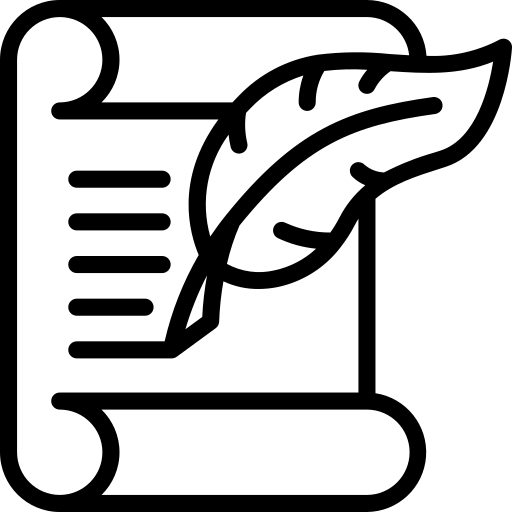

# Conducción autónoma en circuitos creados con mapas de Kohonen

**Link de la memoria del trabajo:** https://e-archivo.uc3m.es/ (Actualizado cuando esté disponible)

## Resumen del trabajo 

Este trabajo está separado en dos partes bien diferenciadas que se muestran en un mismo repositorio ya que ambas utilizan como base el mismo simulador de conducción. En concreto, las dos partes son las siguientes:

* **Conducción autónoma.** Este módulo consiste en conducir un vehículo en Unity utilizando sola y exclusivamente como entrada una imagen generada por un modelo de Red Generativa Adversaria del repositorio https://github.com/davidggz/RealisticRoadsGAN. Para ello, se toma la imagen generada por la GAN y se segmentan las líneas de la carretera y se infiere el ángulo de giro con el uso de Deep Learning.

* **Circuitos aleatorios con mapas de Kohonen.** Este módulo se encarga de generar los circuitos cíclicos del simulador mediante el uso de mapas de Kohonen, un tipo de red de neuronas no supervisada. Esta implementación en C# está basado en la implementación de Diego Vicente https://github.com/DiegoVicen/som-tsp.

Para poder llevar a cabo este proyecto, ha sido necesario utilizar como base el simulador que el usuario de GitHub **tawnkramer** ofrece en su repositorio (https://github.com/tawnkramer/sdsandbox). Todas las modificaciones se han hecho sobre ese código.

# Circuitos aleatorios con mapas de Kohonen 

## Explicación teórica
Los **mapas de Kohonen** son un tipo de red de neuronas capaz de adaptarse a un conjunto de datos de entrada. Normalmente, la red de neuronas de este tipo de arquitecturas es un conjunto de puntos en el espacio de entrada n-dimensional que se va acercando poco a poco a los patrones de entrada más próximos. Para poder hacer este proceso, es necesario tener en cuenta **dos parámetros realmente importantes**:

* **Función de vecindario.** Este parámetro indica cuáles son las neuronas que serán arrastradas junto a la neurona ganadora en cada iteración del entrenamiento. Normalmente, esta función es discreta y muy simple.

* **Forma del mapa de neuronas.** El mapa de neuronas está compuesto por el conjunto de las neuronas en sí y las conexiones que hay entre ellas. Habitualmente, el mapa de neuronas es bidimensional y cada neurona se conecta con cuatro neuronas, generando una especie de paralelogramo conceptual.

El enfoque que se aplica en este trabajo es utilizar el mapa de Kohonen para resolver el **problema del TSP** (Travelling Salesman Problem) de manera aproximada. Para hacer esto, en primer lugar el vecindario pasa de ser bidimensional a ser unidimensional circular, generando un **anillo elástico** que cambia en cada iteración. En segundo lugar, la función de vecindario pasa a ser **gaussiana**, haciendo que cada vez que una neurona es ganadora, se muevan las que están a su lado de manera ponderada.


Como se puede ver en la imagen anterior, en los resultados intermedios se obtienen resultados parecidos a lo que sería un circuito. Retocando algunos de los parámetros (en concreto, la disminución de la ganancia y del radio de la gaussiana), se puede hacer que la red **converja en un estado intermedio**, permitiendo obtener los circuitos que se están buscando. En la siguiente imagen se pueden ver tres circuitos distintos generados con el script de Python.


Una vez se consiguieron los anteriores resultados, se optó por implementar el código en C#. Se tuvieron que hacer algunos cambios sustanciales en el entrenamiento de la red de neuronas pero finalmente se consiguieron los resultados que se pueden ver en la siguiente imagen.


## Código y tutorial de uso de los circuitos

Una vez se ha descargado el proyecto de Unity y se ha importado la carpeta sdsim, el código se puede encontrar en el fichero Assets/Scripts/Kohonen.cs.

Para poder visualizar los circuitos generados con esta técnica, es necesario buscar el **GameObject** llamado **PathManager**. Una vez encontrado este objeto, se debe activar la opción **DoKohonenPath** y desactivar **DoMakeRandomPath**. Cuando esta opción ha sido cambiada, solo se debe reejecutar el simulador.

# Conducción Autónoma con imágenes sintetizadas con Redes Generativas Adversarias

Este módulo consiste hacer la conducción autónoma utilizando solo las imágenes generadas por algunos modelos de GAN obtenidos en el siguiente repositorio https://github.com/davidggz/RealisticRoadsGAN. En concreto, los dos modelos que se han utilizado son GAUGAN entrenado con Cityscapes y Pix2PixHD entrenado con Cityscapes, dos de los mejores modelos obtenidos.

El enfoque que se toma en este módulo está basado en dos fases distintas, la **segmentación de las líneas de la carretera** y la **inferencia del ángulo de giro**.

## Segmentación de las líneas de la carretera

A las imágenes generadas por las GAN se les introduce de manera artificial las líneas de la carretera para intentar emular lo que sería una carretera realista. Para segmentar estas líneas de la carretera se utiliza un **autoencoder**; una estructura convolucional con forma de reloj de arena que es entrenada de manera supervisada.


Una vez el modelo ha sido entrenado al completo, la red convolucional es capaz de **segmentar las líneas de la carretera de manera correcta**. Además, como las imágenes que solo tienen las líneas se han generado a partir del cuello de botella, en este se encuentran todas las características clave de las líneas de la carretera. Por este motivo, no solo se ha creado un segmentador de líneas, sino también un **condensador de información**. En el siguiente gif se puede ver un ejemplo de esta segmentación:


## Inferencia del ángulo de giro

Una vez las líneas de la carretera han sido totalmente segmentadas, inferir el ángulo de giro es trivial. Incluyendo la red densamente conectada y utilizando un nuevo data set compuesto por las imágenes realistas y el ángulo de giro, se puede hacer un modelo rápidamente.

# Instalación
Para poder ejecutar esta parte, se recomienda tener instalado **CUDA** y **CUDNN** para que la inferencia en tiempo real sea rápida. La versión de Python que se necesita para poder ejecutar los modelos con la GPU ha de ser menor o igual a la versión 3.7. En concreto, se recomienda utilizar la **versión 3.7 de Python**. En cuanto a las librerías necesarias para ejecutar todo correctamente, se necesitan las siguientes:

* **Numpy**
* **tensorflow-gpu==1.13.1**
* **Pillow**
* **Matplotlib**
* **OpenCV**
* **keras==2.2.4**
* **torch>=1.0.0.** Instalación en https://pytorch.org/.
* **dominate**
* **dill**
* **scikit-image**

Una vez instaladas estas librerías y cumplidos todos los requisitos, el sistema debería funcionar correctamente. 

# Tutorial de uso 

Para poder ejecutar la conducción autónoma debemos seguir dos simples pasos.

1. **Encender el servidor.** Para ello, tenemos que posicionarnos en la carpeta **src** y ejecutar uno de los dos comandos siguientes:
```
python predict_server-GAUGAN-VAE.py --steeringModel steering/0050-ConduccionAutonoma-0042+DDD-0005.h5 --GAN Cityscapes-LabeledMio-VAE --style_image styleimages/cityscapesPhoto.png
```
```
python predict_server-Pix2PixHD.py --steeringModel steering/0050-ConduccionAutonoma-0042+DDD-0005.h5 --GAN Mod1-OnlyCityscapes-512 
```

2. **Encender el simulador.** Una vez encendido el simulador, solo tenemos que clickar en **"Mundo realista"** para que comience la inferencia en las imágenes generadas por las GAN y, por lo tanto, la conducción autónoma.

Cabe destacar que los modelos ya están incluidos en el propio repositorio, no es necesario descargárselos a posteriori.

## Autor 
David González González <a href="https://www.linkedin.com/in/david-gonzalez-gonzalez/">LinkedIn</a>

## Tutor 
Juan Manuel Alonso Weber <a href="https://www.inf.uc3m.es/component/comprofiler/userprofile/jmaw">Perfil de la universidad</a>
